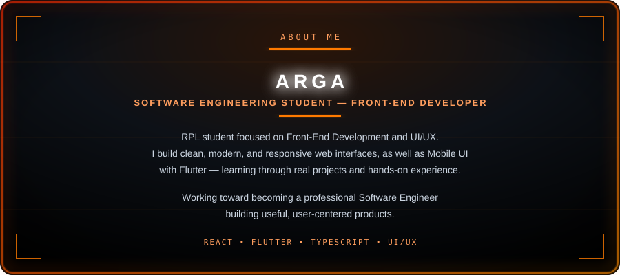
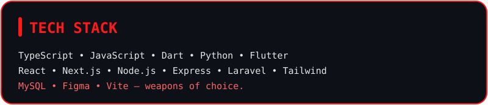
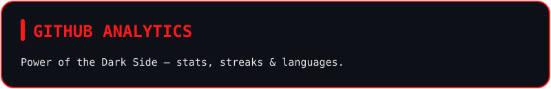
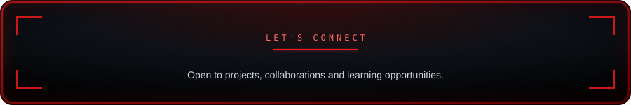

---

---

 

---

 

  

---

 

**Consistency is the game. Every commit is progress.**

  

<picture>
  <source media="(prefers-color-scheme: dark)" srcset="https://raw.githubusercontent.com/argottzz/argottzz/output/pacman-contribution-graph-dark.svg">
  <source media="(prefers-color-scheme: light)" srcset="https://raw.githubusercontent.com/argottzz/argottzz/output/pacman-contribution-graph.svg">
  
</picture>

  

---

 

I'm always open to interesting projects, collaborations, internships, and learning opportunities.

  

  

  

### *On a Journey to Become a Great Front-End Developer*

 

